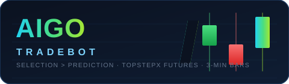
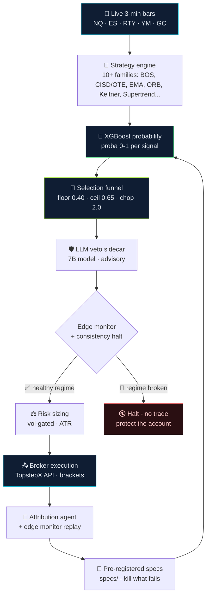

<p align="center">
  
</p>

<p align="center">
  <b>The autonomous TopstepX futures bot where <i>selection beats prediction</i>.</b><br/>
  NQ · ES · RTY · YM · GC — 3-minute bars — fork it, fine-tune it, make it better.
</p>

<p align="center">
  
  
  
  
  
</p>

---

## 🚀 What is AIGO Tradebot?

AIGO Tradebot is a fully autonomous futures trading system for the TopstepX
evaluation platform. It ingests live 3-minute bars for five index/metals
futures, detects signals across **10+ strategy families**, scores every
signal with a trained XGBoost model, and pushes only the highest-quality
subset through a **selection funnel** — because after 5+ years of measured
research, the funnel is the edge, not the predictor.



## 🏆 Why it's built this way

The research record in `specs/` is the real product — every idea gets a
pre-registered spec with a success bar and a kill rule, a blind
out-of-sample run, and a written verdict. **GO. KILL. INCONCLUSIVE.**
No post-hoc tuning. No survivorship stories. Headline findings, verified
on 5+ years of the author's own data:

| Finding | Number |
|---|---|
| Direction-prediction ceiling (every model family tried) | 46–53% — a dead end |
| Best live signal correlation ever measured | r ≈ 0.27 |
| Raw signal engine win rate (unselected — loses money) | ~29% |
| **Funnel-selected subset** win rate | **~47%** at **+0.58R**, PF **2.11** |
| Volatility/regime correlation | r ≈ +0.39 — the one real signal |
| 09:30–12:00 ET entry window vs all-day (out-of-sample) | **+0.455R / PF 1.93** vs +0.027R / PF 1.03 |
| Worst month's damage cut by edge-monitor halt rules | **94%** |

The bot **does not chase 70% win rates**. It targets a positive-expectancy
funnel and tells the truth when an idea dies. That honesty is why it's
worth forking.

## 🔧 Quick start

```bash
git clone https://github.com/Sundar1k/AIGOtradebot.git
cd AIGOtradebot
python -m venv .venv && source .venv/bin/activate
pip install -r requirements.txt
cp .env.example .env        # add your TopstepX credentials
python bot.py               # paper-first: sim_broker / paper_trade.py
```

Trained artifacts ship in `models/` and `ppo_exit/policies/`. Market data
is not distributed — regenerate with `python backfill_bars.py` using your
own account, or start research with `keyless_feed.py` (free, delayed,
no-signup feed). Full config knobs: see `.env.example` and `config.py`.

## 🧬 Make it YOURS — fine-tune & progress it

This project is an open invitation. The entire point of publishing the
code AND the research is that you can take it further than one person can:

- **Fine-tune the models** — the XGBoost/Chronos models in `models/` and
  the PPO exit policies in `ppo_exit/` are trainable artifacts. `finetune/`
  training pipelines and `retrain` scripts show the recipe (weights too
  large to ship; train your own).
- **Add a strategy** — implement in `strategies/`, validate through the
  `selection_validator/` harness, prove it beats the funnel baseline.
- **Run a pre-registered experiment** — copy the spec protocol from
  `specs/`: write the success bar BEFORE the test, run it blind, publish
  the verdict. Kills are celebrated, not hidden.
- **Open a PR** — bug fixes, new gates, better docs, whatever. PRs are
  welcome. If your change lifts the funnel's out-of-sample expectancy,
  it deserves to be in.

### Contribution protocol (the short version)

1. Fork the repo.
2. State your hypothesis and your kill rule up front (see `specs/` for the
   format — steal it).
3. Test point-in-time, out-of-sample. No look-ahead, no post-hoc tuning.
4. Report the numbers either way. A clean KILL is a good outcome.

## ⚖️ License & commission

- **Author:** Sundar1k. This evolved project is licensed under the
  **AIGO Tradebot Public License v1.0** (`LICENSE`): attribution required,
  plus a **5% commission on Net Trading Profits** if you use this software
  to generate trading income — quarterly, in BTC to
  `bc1q3xqpc603l80vwcn9dr9d8g7rdevl42mldwvlpn`.
- Plain-language terms: `COMMISSION.md`.
- A handful of unmodified files originate from the MIT-licensed
  [algoTraderBot](https://github.com/johnamcruz/algoTraderBot) by John
  Cruz and remain MIT — see `NOTICE.md`.
- Trading futures involves substantial risk of loss. Past performance,
  including everything in `specs/`, is not a guarantee of future results.
  Nothing here is financial advice.

---

<p align="center">
  <sub>AIGO Tradebot · selection over prediction · made with 🔥 and honest kill rules</sub>
</p>
